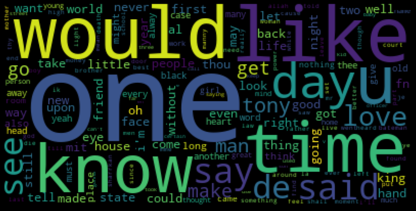
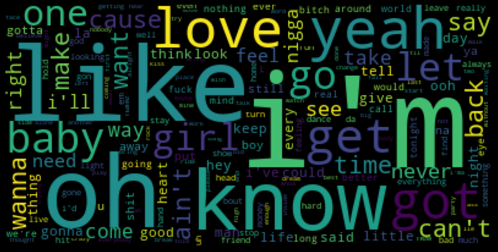
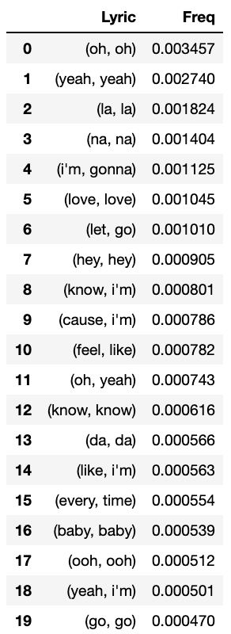
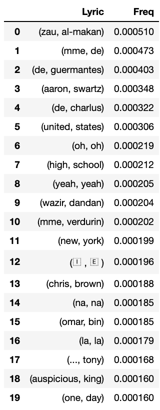
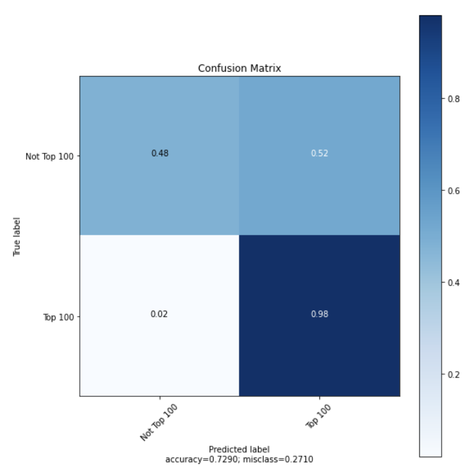
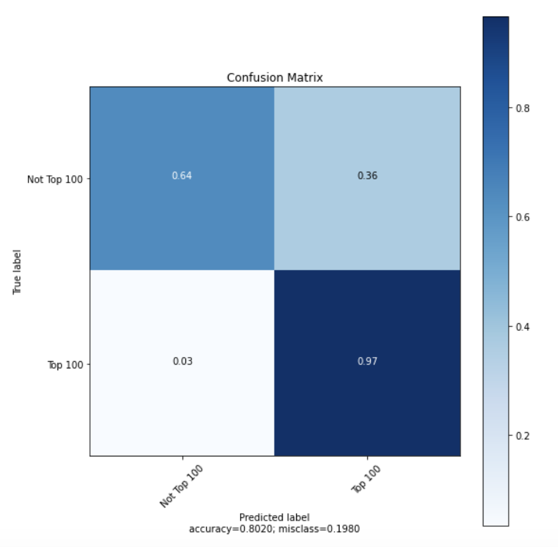
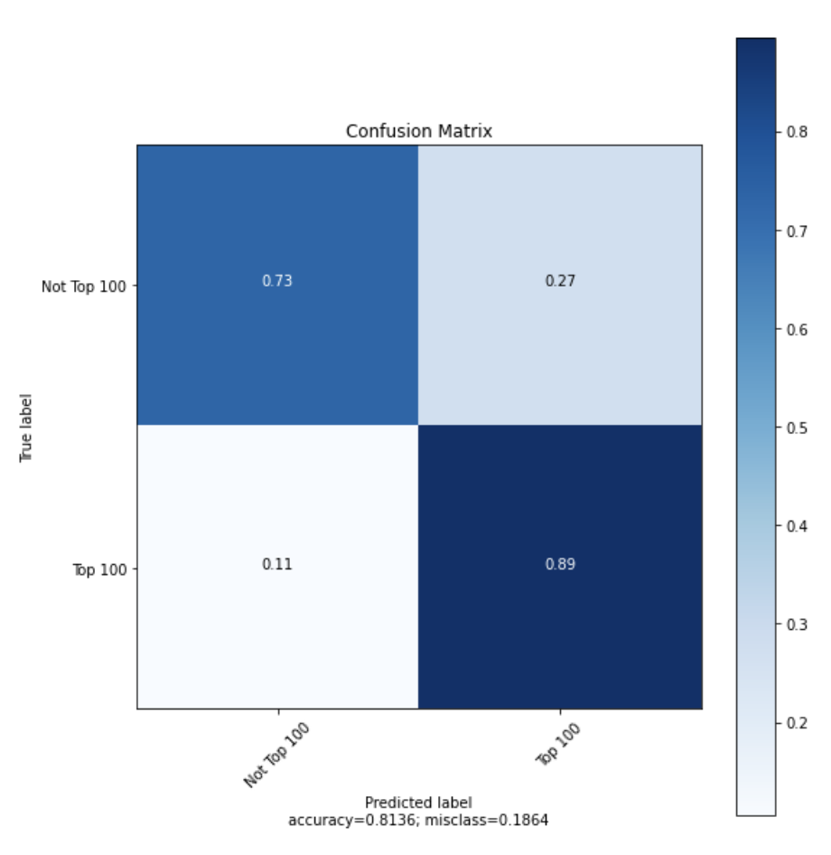
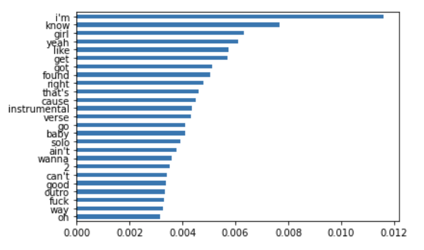
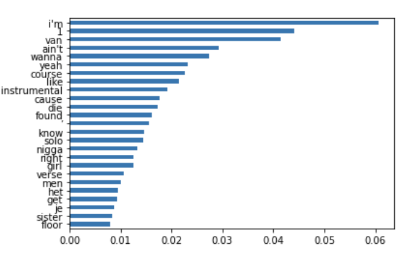
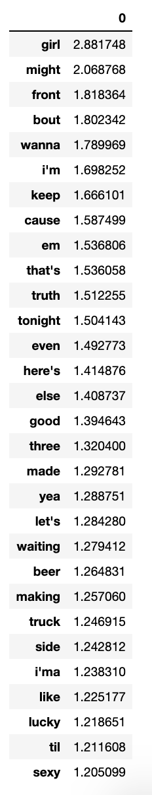

# Capstone

## Introduction

In the following notebook we will be uncovering information from 3 datasets. Particularly, we will be creating a model which explores the likelyhood of a song being associated with the billboard top 100 list based on lyrics. To do this we will be walking through three classification models. The three models I'll be working through are random forest, XGB and SVM. The data we will be looking at is comprised of a list of features from variance and tempo to lyrics and artist name. What we explore throughout this notebook will help us further understand the lyrics that are associated most commonly with being in the Billboards Top 100. We'll also need to understand their importance. The models will be most helpful for music producers, mixers and or artists looking to increase their chances at a popular song and have a higher ROI for the work they're putting in.

## The Dataset (Obtaining the data)

For this project, I'll be working with three datasets. The three data sets contain information from the billboards top 100, spotify features, and a third data set used as songs, not in the billboards top 100 (after cleaning the data). The different features are as follows
* Title
* Artist
* Top Genre
* Year
* BPM
* Energy
* Danceability
* Popularity
* Accousticness
* Length
* Valence
* Loudness
* Danceability
* Lyrics
* Weekly.rank
* Weeks.on.chart
* Peak.position

## Cleaning Data (Scrub)
The first step of cleaning my data was to actually scrape for more data where it wasn't provided. In some of my datasets I was missing the lyrics, so I needed to scrape for those lyrics using the Genius API.

Once I grabbed the data, I then needed to view the data to make sure there were no null values, random strings and outliers that would impact our information negatively. To do this I needed to:
* Remove any unnecessary columns that didn't fit what we were solving for
* Checked for Null values and remove the rows in its entirety.
* Checking for specific null values a replacing them with the mean values
* Renaming my columns to be more digestable
* Dealing with stopwords
* Seperated my columns into X and y dataframes
* X was my Lyrics and y was my target (top.100)

## Exploring Data
I wanted to get an understanding of some of the correlations occuring post cleaning my data. I went through and created a wordcloud to help show us the frequency of the lyrics that appear in the top 100. I also created a swarm / bar plot hybrid comrpised of the genres and how they matched up against being in the top 100. The largest takeaway was that Country, Pop and Rap / Hip Hop had largest correlations to being in the top 100 in all of the three categories mentioned previously.
### Most frequently used Lyrics in BB Top 100

### Most frequently used Lyrics not in BB Top 100

### Most Frequently Paired Lyrics in BB Top 100

### Most Frequently Paired Lyrics in BB Top 100

## Modeling Data
Finally I needed to model my data. What was most important to me and for any client will be the recall and accuracy of our model when it comes to correctly identifying if a song is or is not capable of being in the top 100. Recall expresses the ability to find all relevant instances in a dataset so this needed to be as close to 1 as we could get. Again we wanted to favor the model towards both top 100 and non top 100 so we are identifying songs correctly.

I chose to use 3 models. Random Forests, XGB and SVM. As we explore the data we will find which model performed the best in regards to what we're looking for stated before.

Random Forests

XGB

SVM

Another key element was taking a look at which lyric appeared most frequently, something we also address as its importance in the data set which are provided below.

### Feature Importance (Random Forest)

### Feature Importance (XGB)

### Feature Importance (SVM)

## Conclusion

In conclusion the model that performed most strongly was our XGB model. We found that there are certain lyrics that appeared most frequently as well as had the most impact when it came to these lyrics being in the top 100. Some of the most important lyrics found were:
- Van
- Die
- Age
- Running

There were also plenty of lyrics that would be considered by most as 'common' which in fairness they are. I believe this speaks to the simplicity of the music industry, lyrically at least.

Another thing to take note on is how genre plays a role in regards to being in the top 100. The three most successful categories were Country, Pop and Hip Hop / Rap. My suggestion to anyone looking to make headway in music would be to leverage the important words we found and make sure it's in one of the 3 or a combination of the 2 genres stated previously.

